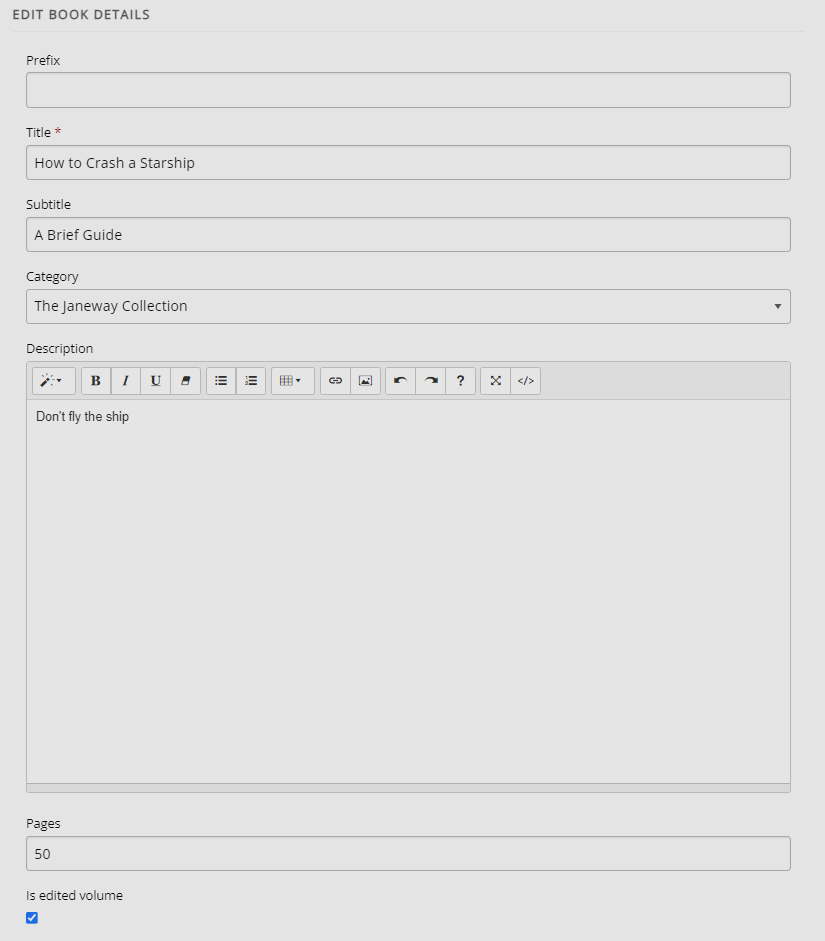
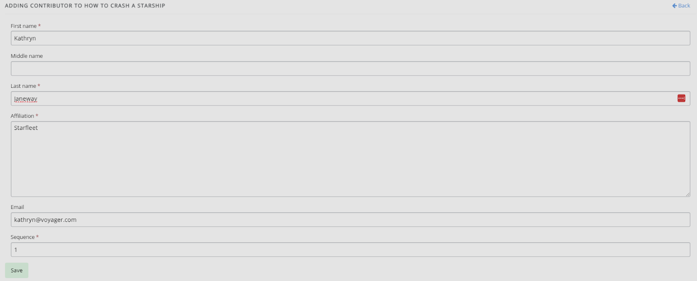
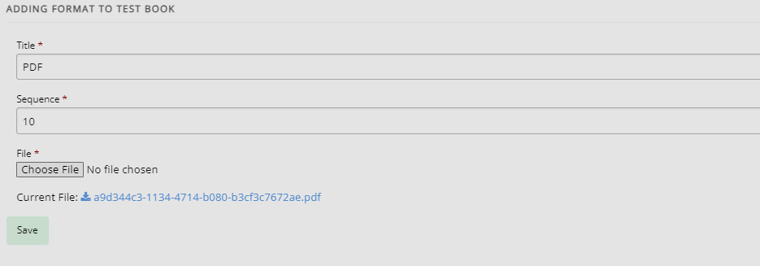
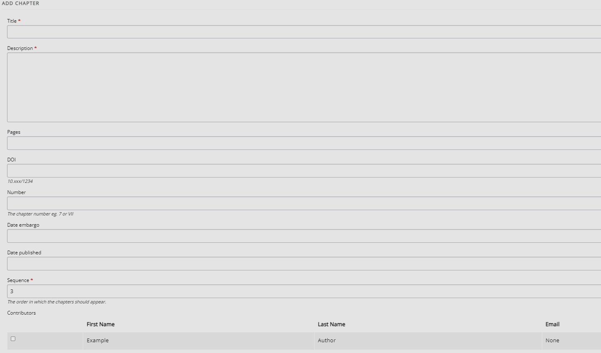
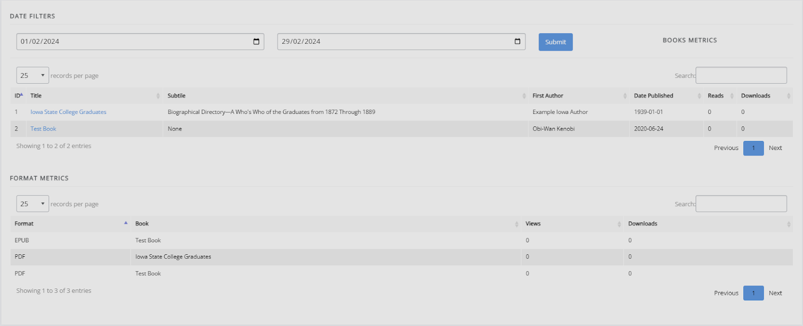

# Books plugin

Through this plugin, all book-related tasks and metadata are managed.
This plugin has three key functionalities:

-   Adding new books through either individual uploads or a bulk import.
-   Metrics for reporting (overall or monthly)
-   Categories - this can be used for imprints, series or other types of
    categorisation you may wish to use for published materials.

## Main dashboard

From the books dashboard, you can manage all tasks and data related to
monographs (or similar items). It also provides an overview of all items
published through this plug-in and the following information for all of
them (they can also be sorted by any of these):

-   ID
-   Title
-   Subtitle
-   First Author
-   ISBN
-   DOI
-   Date Published
-   Reads
-   Downloads

The bar on top represents access to the key functions of the books plugin:

-   Metrics by Month
-   (General) Metrics
-   Import Books
-   Categories
-   Add New Book

## Categories

This is where categories can be created that books can be assigned to;such as imprints, collections or even record labels.

All current categories are displayed on the right-hand side, with a link
to the live website where you can view all monographs currently present
in a category.

Whilst books can be assigned to a category at any moment, it is
necessary to create the category before a book can be assigned.
Categories cannot be created through the ‘Add a new book’ interface.

When adding a new category, the following fields are available:

-   Name  
    -   This is a required field.

-   Description

-   Display title  
    -   Leave this unchecked if you want to hide the category title.

-   Chapter name  
    -   This is where the ‘Chapter’ label can be edited, in case the
        individual components of publications assigned to this category
        are not chapters. This is a required field.

-   Chapter name plural  
    -   This is where the plural for the ‘Chapter’ label can be edited
        to ensure the label is pluralised correctly. This is a required
        field.

-   Buy button text  
    -   This defaults to “Buy this Book”. If the item is not a book, you
        will need to update this field. This is a required field.

>[!NOTE]
>This field is case-sensitive. If you do not wish for these words to be
capitalised by default (and thus mid-sentence), you need to enter them
in lowercase. See the image above for an example of how this label
displays when it is capitalised. Janeway will automatically capitalise
the words when they appear at the start of a sentence.

## Adding a new book

New monographs are added through the ‘Add new book’ option, which is
positioned rightmost in the topbar of the main dashboard.

Before the manuscript files can be uploaded, various metadata fields
need to be completed first, displayed on the left-hand side of the page
under ‘Book details’.

This section contains the following fields:

-   Prefix

-   Title  
    -   This is a required field.

-   Subtitle

-   Category  
    -   This is where a publication can be assigned to an imprint, if
        applicable.

-   Description  
    -   The book’s description can be provided here.

-   Pages  
    -   This is the total number of pages.

-   Edited volume?  
    -   If this is an edited volume, tick this box. This will ensure the
        citation is adjusted to match.

-   Open Access?  
    -   If this monograph is Open Access, tick this box. This will
        ensure the monograph is marked as open access and made available
        on the website.

-   Date embargo  
    -   This will specify the date until which the title is embargoed.

-   Date published  
    -   This will specify the date of publication (this can be before
        the upload date for example if the official publication date
        precedes the date on which the digital edition was made
        available).

-   Publisher name  
    -   This is a required field.

-   Publisher location  
    -   This is a required field.

-   Cover

-   DOI  
    -   DOIs for monographs and chapters cannot be minted directly
        through Janeway, but if a DOI has been chosen, it can be added
        here. To mint a DOI for a monograph or chapter after it has been
        uploaded, you can do so through the [Crossref
        website](https://apps.crossref.org/webDeposit/)

-   ISBN

-   Purchase URL  
    -   If this book has an option for physical purchase, this is where
        this can be linked. It will show as an option next to the ‘Read’
        and ‘Download’ buttons on the book’s page.

-   Remote URL  
    -   If this monograph is not hosted on Janeway but you would like it
        linked on the website, this is where to provide the link. If the
        monograph is hosted on Janeway (if you are uploading manuscript
        files), there is no need for this.

-   Remote label  
    -   This will set the label for the link above. If not set, it will
        display the domain name.

-   Licence information  
    -   Add copyright and/or licence information here.

-   Custom how-to-cite  
    -   To be used only if the citation block generated by Janeway is
        not suitable.

After the required fields above have been filled in and you have pressed
‘Save Book’, you can now move onto the following steps (displayed on the
right-hand side in Janeway):

### Contributors

All contributors to a volume can be entered here. If you are uploading
individual chapters in addition to the full manuscript, the respective
authors and/or contributors for these chapters will need to be entered
here. If they are not entered here, they can not be selected as
contributors when uploading individual chapters.

This page contains the following fields:

-   First name  
    -   This is a required field.

-   Middle name

-   Last name  
    -   This is a required field.

-   Affiliation  
    -   This is a required field.

-   Email

-   Sequence  
    -   This determines the order in which contributors are displayed
        and will be auto-filled (but can be edited). This is a required
        field.

### Formats

This is where manuscript files are uploaded. Various file types can be
used, such as PDF, EPUB and Mobi.

This page contains the following fields:

-   Title  
    -   The title field is where you specify the format. This will be
        displayed on the website as ‘Download \[title\]’ (see image
        below). This field is case-sensitive, so you may wish to be
        consistent with capitalisation. This is a required field.

-   Sequence  
    -   The sequence field will determine in what order the respective
        ‘Read’ and ‘Download’ options will be displayed. This is useful
        to ensure consistency in order of the options across books.

When an .ePub is uploaded, Janeway will generate a ‘Read this book’
option on the book page. This allows users to read the book using an
online reader, without requiring a download. This can be disabled on
request.

Make sure that the filename of the file uploaded is consistent and
correct. Whilst Janeway will change the filename to the title
internally, depending on the application used to open the document after
download, the original filename might still be visible. Google Chrome is
an example of an application that might still display the original
filename in its reader toolbar, as displayed in the image below.

>[!Note]
>‘Read this book’ will always follow the ePub download option and ‘Buy
this book’ will always be the last one in the sequence.

### Chapters

If uploading individual chapters, this is where they are uploaded and
the metadata is entered. This might be of particular interest if the
book is an edited volume with multiple contributors; individual chapter
uploads with their respective metadata allow for higher discoverability.

>[!Note]
>The chapter-level uploads are limited to one file, so only one file type
can be used here.

This page contains the following fields:

-   Title  
    -   This is a required field.

-   Description  
    -   This is a required field.

-   Pages

-   DOI  
    -   Janeway will not automatically generate a DOI for individual
        chapters, these will need to be registered with Crossref
        manually. This can be done through the [Crossref
        website](https://apps.crossref.org/webDeposit/)

-   Number  
    -   This is where the chapter number is set; this can be zero for
        prelims, appendices etc.

-   Date embargo

-   Date published

-   Sequence  
    -   This will determine in what order the chapters are displayed.
        This field will autofill and chapters will appear in the order
        they were added to Janeway, but this can be edited through this
        field. This is a required field.

-   Contributors  
    -   This is where contributors to chapters can be selected, for them
        to appear their details need to have been entered in the
        ‘Contributors’ fields through the Book Details dashboard.

-   Licence information

-   Keywords  
    -   This is currently a list from which keywords can be selected.
        This will be updated in the future.

## Importing books

You can import the metadata for multiple monographs into Janeway at once
using the ‘import books’ option. This is commonly used for migrations.

Metadata can be imported using a .csv file encoded in UTF-8 [^1] with
certain headers. An example import with pre-prepared headers is coming soon.

These headers are:

| Field              | Notes                                              | Required? |
|--------------------|----------------------------------------------------|-----------|
| Prefix             |                                                    | No        |
| Title              |                                                    | Yes       |
| Subtitle           |                                                    | No        |
| Description        |                                                    | No        |
| Pages              |                                                    | Yes [^2] |
| Edited volume      | If this is an edited volume, set this field to '1' | No        |
| Date published     |                                                    | No        |
| Publisher name     |                                                    | No        |
| Publisher location |                                                    | No        |
| DOI                |                                                    | No        |
| ISBN               |                                                    | No        |
| Purchase URL       |                                                    | No        |

Books import headers

>[!Warning]
>Due to a bug, UTF-8 does not seem to be properly recognised when
specific browser-editor combinations are used. We are investigating
this. If the file is not properly read upon upload, you may also wish to
try a regular .csv file (not UTF-8 encoded). If you still encounter an
error, please contact Support.

Once the import file has successfully been uploaded, the imported books
will show on the main dashboard. You can now click on these to upload
the files themselves and to make any further edits.

[^1]: Using a character encoding other than UTF-8 can cause bugs during imports or updates. `(What is character encoding?) <https://www.w3.org/International/questions/qa-what-is-encoding>`_. These apps save .csvs with UTF-8 by default: OpenRefine, LibreOffice, Google Sheets, and Apple Numbers. However! If you use Microsoft Excel, keep in mind some versions don’t automatically create .csv files with UTF-8 character encoding. This may cause punctuation and special characters to be garbled on import. So, when saving, look for the ‘.csv (UTF-8)’ option in the drop-down box.

[^2]: Required due to a bug - we aim to fix this in the near future.
## Reporting metrics for books

Reporting for books does not run through the reporting plug-in, instead
it is done separately through the books plug-in.

On this page, you can view the general access metrics for monographs, as
well as for each format of a monograph. On this page, date ranges can be
selected per day, rather than per month as in the ‘Metrics by month’
page. The date range affects both the Book Metrics field and the Format
Metrics field.

>[!Note]
>If a monograph is not available for open-access downloading/reading, no
data will be collected and the metrics will remain at 0.

### Books metrics

The first section of this dashboard displays the total views and
downloads (each in their respective column) per book. The columns can be
sorted by ID, Title, Subtitle, First Author name, Date published, Reads
and Downloads.

### Format Metrics

This section sorts the data by format, providing insights into how
specific formats are performing. This section can be sorted by Format,
Title, Views and Downloads.

>[!Note]
>The total views and downloads in this report may differ slightly from
the amounts listed in the monthly report discussed above. This is due to
an issue with time zones and the cutoff points used for the calculation.
